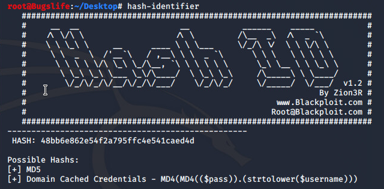
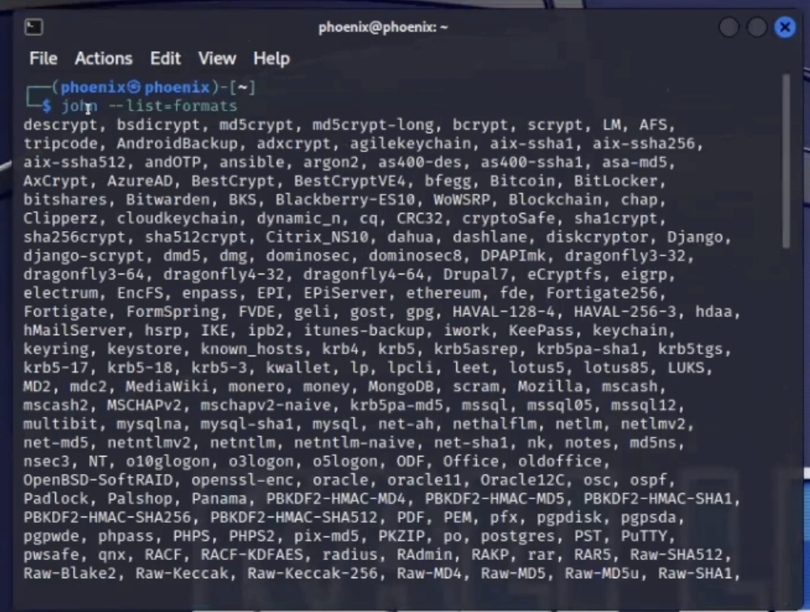
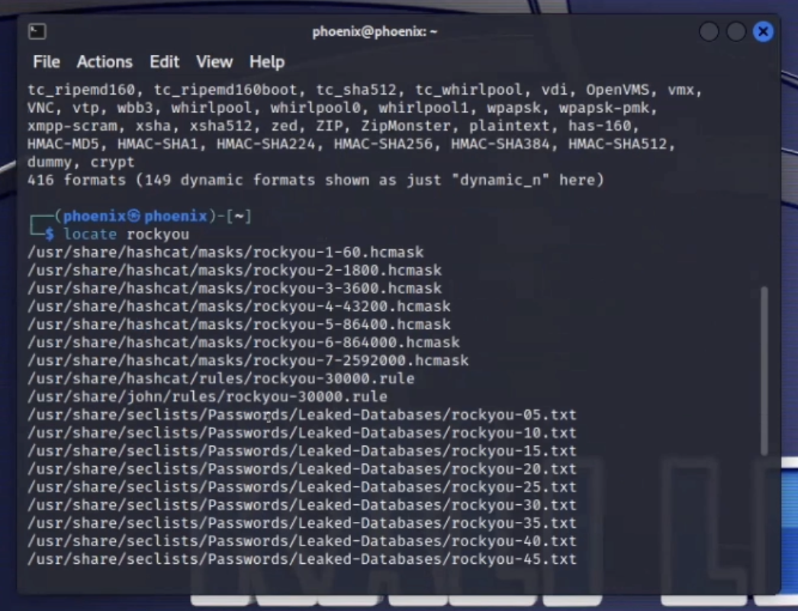
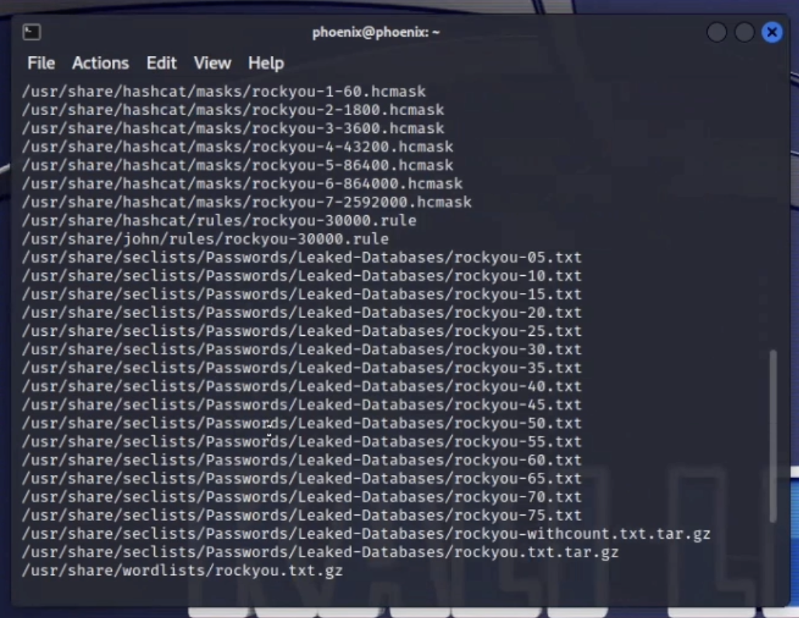
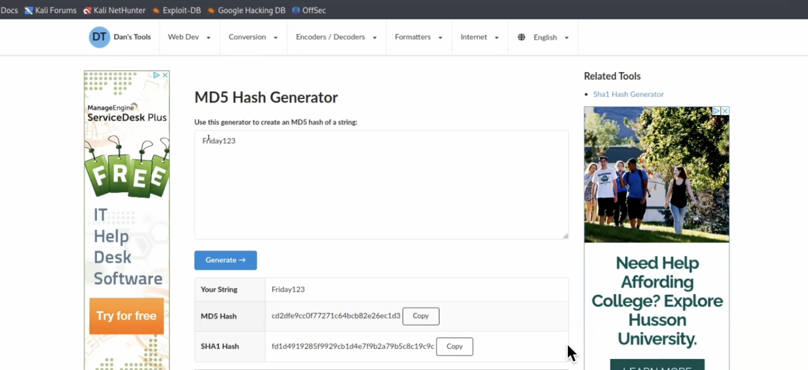
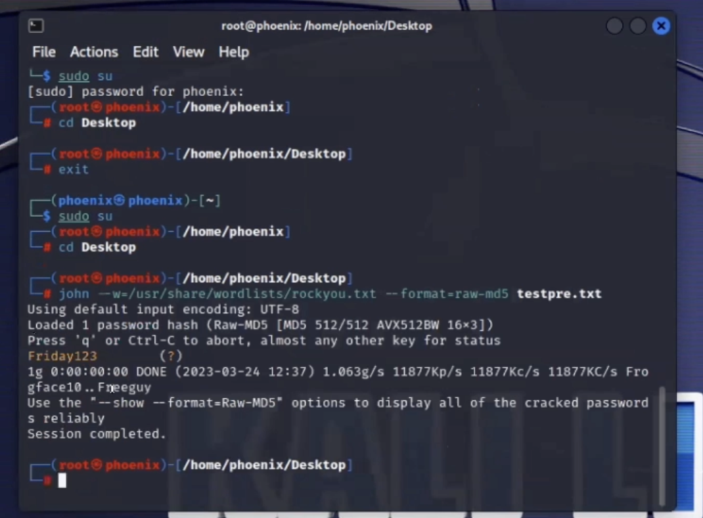
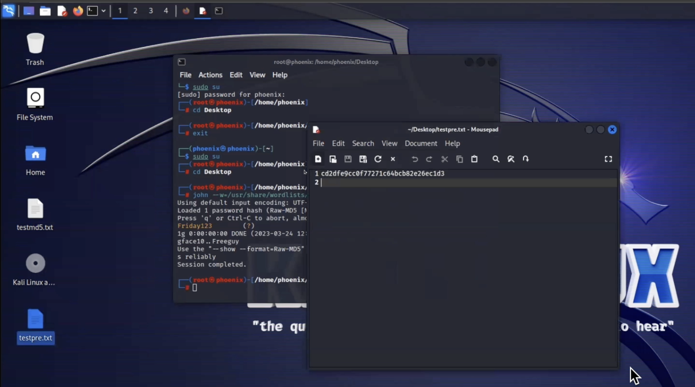

# John-The-Ripper-Kali-Linux
## This repository is to show few commands on how john the ripper can be used in Kali Linux to decrypt encrypted passwords and messages.
`Disclaimer:`   
 `This is for educational purposes only. The content here  was done by a computer science student.`  

## Start!
### Key points.
1. **_Kali-Linux_** 
2. **_Hash-Indetifier_**
3. **_Rockyou Dictionery_** 
4. **_John The Ripper_**

# Kali Linux
**Kali by default is _considered_ as a penetration testing GUI; therefore it comes with pen testing tools pre-installed. To properly execute John commands switch to root user.** 
__*sudo su__
# In this section there's screenshots on how to start the decryption method.
First start by using an ecryption identifier in this case I have used __Hash-Identifier__ because my encryption is an md5 file has I used  __MD5 Hash Generator__ to generate my encryption. 
- Type __hash-identifier__ to enter encryption indetifier mode.
+ Then type the hash encryption and press __Enter/return__ and the hash will be identified.
* After the identification press __Control & ESC__  to return  __user mode__

__Notice that the user is in Root mode.__ 

## Next word lists analysis and hacking.
Here I typed the command __john --list=formats__ to show me all the encryption formats __John The Ripper__ supports and there's an enourmous amount of encryptions.

Then locate __Rockyou__ 

In case you don't have __/usr/share/worlists/rockyou.txt.gz__ try the following commands __cd wordlist > cd rockyou > ls > gunzip rockyou.txt__  to unzip __gz file__ then __cd__ back to where you have your encrypted file.
type __locate Rockyou__ at this point __/usr/share/worlists/rockyou.txt.gz__ should appear.
Navigate to your browser and search for __MD5__ generator.
type any random word and click generate and copy either __MD5 Hash or SHA1 Hash__

Back to your terminal make sure you are on __root__ user mode.
create a __.txt__ file manually or use the command __echo "ecryption" > .txt__ to create a file with the encryption on it.

On your __Kali Terminal__ type the command __john --w=/usr/share/wordlists/rockyou.txt --format=raw-md5 .your .txt encrypted file__ this command should decrypt your encrypted message or password.
  
 

  __Note: In this demo I used both john and rockyou to sort out a dictionary attack john used the cracking methods and rockyou used it's own dictionary__   

  # Thank You!
 